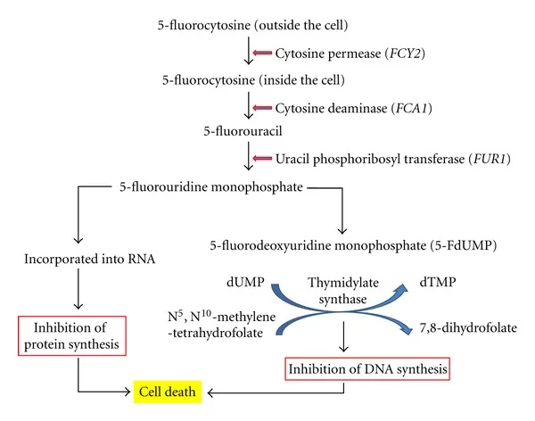
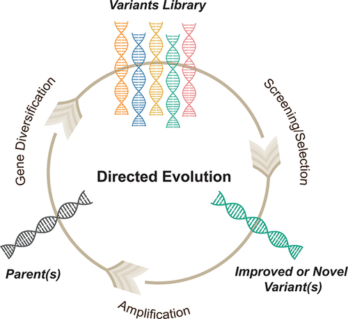

# Background

# **Why improve existing cancer therapies?**
&nbsp;&nbsp;&nbsp;&nbsp;&nbsp;&nbsp;&nbsp;&nbsp;&nbsp;&nbsp;Cancer is amongst the largest killers in the world, with over 9.9 million people succumbing to its throes in the year 2021. The most widely accepted treatment for this is chemotherapy, which can pose deleterious effects to not only malignant, but also healthy cells of the body, along with reduction of the immune response due to its non-specificity and low efficacy. There is an immediate need to introduce targeted therapeutic drugs in order to combat more aggressive cancers. Realizing this tremendous potential for improved forms of targeted cancer therapy, our team resolved to work on a potential cancer therapy involving therapeutic drugs in the form of enzyme-prodrug therapy.
{: style="width:500px;margin:20px;display: block;margin-left: auto;margin-right: auto;"}

Source: IHME, Global Burden of Disease (2019)

# **About cytosine deaminase and its enzymatic function**
&nbsp;&nbsp;&nbsp;&nbsp;&nbsp;&nbsp;&nbsp;&nbsp;&nbsp;&nbsp;The enzyme cytosine deaminase is found in several prokaryotes and a few eukaryotes. Our project adopts the deamination of 5-fluorocytosine (5FC) as the inactive drug into the active 5- fluorouracil (5FU) by employing yeast cytosine deaminase (yCD). 5FU is an antimetabolite interfering with the synthesis of thymine by altering the shape of thymidylate synthase, causing errors in DNA replication and preventing tumor cell proliferation. Targeted delivery of this prodrug to the tumor regions can lead to apoptosis of the cells to produce anti-cancer effects. The direct administration of 5FU may induce several side effects such as increased risk of getting infections, bleeding, and breathlessness. Since 5FC is not deaminated in mammalian cells and is well absorbed, 5FC and CD delivery has little intrinsic toxicity and poses several advantages over direct 5FU delivery. 
{: style="width:500px; margin:20px;display: block;margin-left: auto;margin-right: auto;"}

Source: Rooseboom, Martijn & Commandeur, Jan & Vermeulen, Nico P.E.. (2004). Enzyme-Catalyzed Activation of Anticancer Prodrugs. Pharmacological reviews

{: style="width:500px; margin:20px;display: block;margin-left: auto;margin-right: auto;"}

Source: M. Anaul Kabir, Zulfiqar Ahmad, "Candida Infections and Their Prevention", International Scholarly Research Notices, vol. 2013, Article ID 763628, 13 pages, 2013. https://doi.org/10.5402/2013/763628

&nbsp;&nbsp;&nbsp;&nbsp;&nbsp;&nbsp;&nbsp;&nbsp;&nbsp;&nbsp;The enzyme CD is known to sustain an optimum pH of 7.0-7.4. Owing to the low pH conditions found in microtumor environments, the wild type enzyme needs to be mutated to stably function under slightly acidic conditions. Thus, we aim to engineer mutant CD strains with improved stability in the acidic pH range resembling the microtumor environment. We have chosen cytosine deaminase from Saccharomyces cerevisiae (yCD) for optimization over its bacterial counterpart (bCD) due to its improved efficacy and sensitivity towards 5-FC.
{: style="width:500px; margin:20px;display: block;margin-left: auto;margin-right: auto;"}

Source: Hao, Guanyu & Xu, Zhi & Li, Li. (2018). Manipulating extracellular tumor pH: An effective target for cancer therapy. RSC Advances. 8. 22182-22192. 10.1039/C8RA02095G

# **What is directed evolution?**
Directed evolution is a method which aims to mimic the process of natural selection to attain a specific predefined-goal. Mutations are induced in a given protein and nucleic acid, followed by assaying proteins and selecting the best mutant for the required function. This requires the structure of the protein to be studied in detail, in order to better understand the regions to be mutated. The broad steps involved in performing directed evolution are the generation of multiple mutant libraries, followed by screening for the best mutants. A superior mutant may be produced from the best mutants through genetic recombination. 

Owing to the refinements and advancements that directed evolution has brought to the field of synthetic biology, our team concluded that it was the best method to facilitate achieving our goal of creating a pH-stable mutant of cytosine deaminase.
{: style="width:500px; margin:20px;display: block;margin-left: auto;margin-right: auto;"}

Source: Yajie Wang, Pu Xue, Mingfeng Cao, Tianhao Yu, Stephan T. Lane, and Huimin Zhao
Chemical Reviews 2021 121 (20), 12384-12444
DOI: 10.1021/acs.chemrev.1c00260

# **An overview of the computational methods used**
**pStab web server:** The pStab webserver predicts the variation in stability of protein mutants under varying experimental conditions of ionic strength and temperature using the electrostatic  Debye-Hückel interaction energy of charged residues. A structure based statistical mechanical model is then employed to predict the thermal stability of the mutants. The server gives a stability-sorted list of the top 5000 mutants ordered based on their net electrostatic interaction energies and locations of mutational hotspots.

**propKa:** propKa web server provides an empirical method to predict the variation of pKa values of protein’s side chains based on the position of the group and chemical interactions with other groups in its vicinity. Using the tool, Intra-protein electrostatic interactions of the amino acid residues at the active site of the target enzyme was identified. Any mutation affecting amino acid residues interacting with the active site amino acid residues was avoided. 

**pyMOL:** pyMOL is a powerful molecular simulation software to visualize the three dimensional structure of proteins and other macromolecules. pyMOL was used to generate the PDB files of stable mutant enzymes identified from the pStab server. The PDB of the mutant molecule was uploaded to pSTAB and the electrostatic energy of the triple mutants were obtained to analyze their stability.

[Back to top](#)
