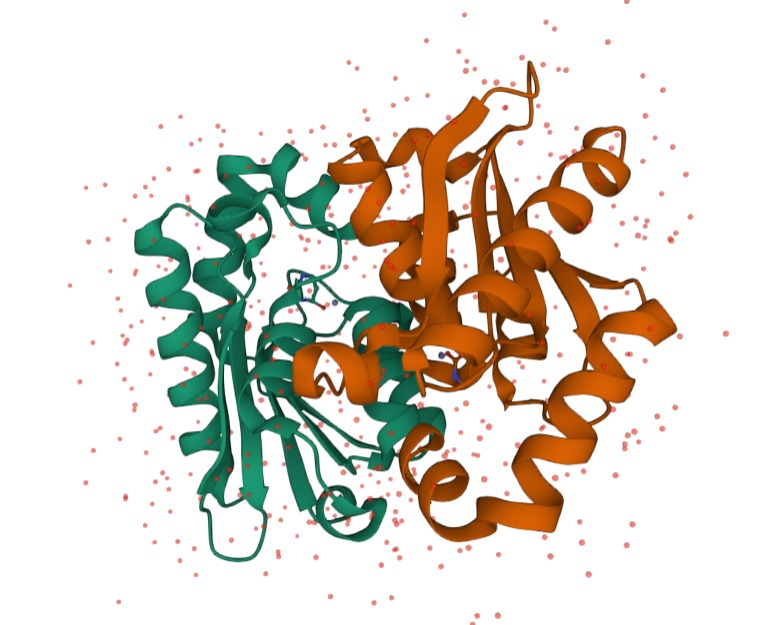
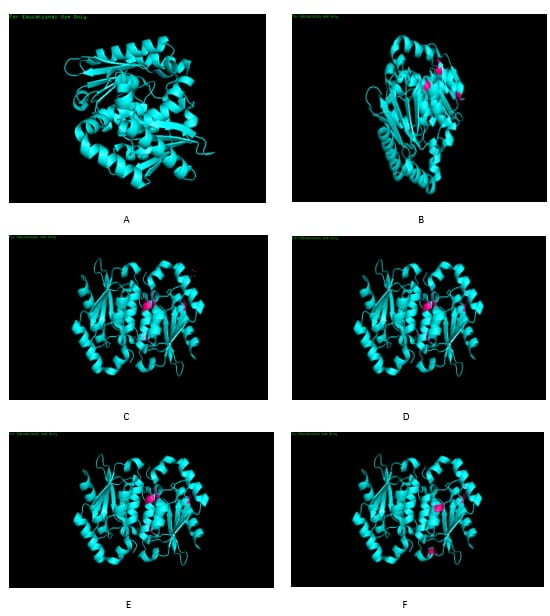

# Results

# **Structural Analysis of yCD** 

Yeast cytosine deaminase is composed of 158 residues. Its protein structure consists of a central 5-strandedβ-sheet (β1 - β5), with the strand order 2, 1, 3, 4, 5. β1 runs antiparallel to the other strands. This sheet is sandwiched by -helices, with two (αA, αE) on one side and three (αB Figure 5 - αD) on the other side. It forms a tightly packed dimer in the crystallographic asymmetric unit, with subunits without considerable differences. There are 18 direct hydrogen bonds across the dimer interface. The center of the dimer contains two hydrophobic patches formed by Met93, Ala97, and Met100 and a buried water molecule surrounded by Thr60, Ile65, and Met93. The chains of Tyr121 enclose four water molecules in a cavity between αC and αD, flanked by two salt bridges between Asp92 and Arg125 [15]. The active site contains one tightly bound metal ion, identified as zinc based on anomalous data. The zinc ion exhibits tetrahedral coordination with Cys91, Cys94, His62, and the hydroxyl group of the bound inhibitor 3,4-dihydrouracil (DHU) [16]. The protein ligands are present on the N termini of the αB and αC helices. The inhibitor 2-hydroxypyrimidine is embedded in the active site in its hydrated form. The inhibitor’s OH4 group directly coordinates with the zinc ion and interacts with Glu64 and Cys91. The N3 atom interacts with Glu64, the O2 atom forms hydrogen bonds with Gly63 and Asn51, and the N1 atom exhibits interactions with Asp155. As a result, yCD converts hydroxypyrimidine into 4-(R)-hydroxyl-3,4-dihydropyrimidine.

{: style="width:500px;margin:20px;display: block;margin-left: auto;margin-right: auto;"}

# **Reaction Mechanism**

The yeast cytosine deaminase protein uses zinc in its catalytic binding domain. It is likely to undergo a concerted reaction, with zinc being ligated in a distorted tetrahedral form, with zinc’s filled d orbitals allowing it to change from a 4 ligand form to a 5 ligand form with no loss in energy. We also hypothesize that the pH activity change may impact the structure of the zinc integration in the protein due to differing availability of H+ ions at different pH values. This would change the ligation number of zinc, and possibly the structure at the active site.

{: style="width:500px;margin:20px;display: block;margin-left: auto;margin-right: auto;"}

At pH 5 the concentration of hydrogen ions is high. These hydrogen ions attack the oxygen marked as 1 a higher concentration than at pH 7. Once the hydrogen ions in the medium forms a bond with the oxygen, it inhibits the formation of hydrogen bond with cytosine. Hence, hydrogen ions inhibit the deamination of cytosine. The uracil production, thus comes down when the pH is decreased. This reaction hindered by the hydrogen ions is depicted in Figure 5. pH Stability The stability of various mutants of yCD at pH 5 is studied using pSTAB, a software used to engineer protein stabilities. The wild type yCD enzyme is more stable at pH 5 than at pH 7. However, we have tried to improve the stability of yCD at pH 5 by inducing various mutations. The pSTAB program suggested a list of residues which are hotspots for improving the stability of cytosine deaminase. This includes a list of double, triple and quadruple mutants values which are included in table 1

# **pH Stability** 

The stability of various mutants of yCD at pH 5 is studied using, pSTAB a software used to engineer protein stabilities. The wild type yCD enzyme is more stable at pH 5 than at pH 7. However, we have tried to improve the stability of yCD at pH 5 by inducing various mutations. The pSTAB program suggested a list of residues which are hotspots for improving the stability of cytosine deaminase. This includes a list of double, triple and quadruple mutants values which are included in table 1

Table 1

| Sr. No  | Number of Mutants | Residue | Charge of amino acid | Residue | Charge of amino acid | Residue | Charge of amino acid | Residue | Charge of amino acid | "ΔE Values"        |
| :------ | :---------------- | :------ | :------------------- | :------ | :------------------- | :------ | :------------------- | :------ | :------------------- | :---------- |
| 1       | 4                 | D92     | 0                    | E110    | 0                    | K117    | 0                    | R125    | 0                    | -104.75632  |
| 2       | 4                 | E110    | 1                    | R125    | -1                   | K142    | -1                   | D146    | 1                    | -104.155473 |
| 3       | 4                 | D92     | 0                    | E110    | 0                    | K117    | 0                    | H127    | 0                    | -104.080363 |
| 4       | 4                 | E110    | 1                    | K120    | -1                   | R125    | -1                   | E158    | 1                    | -103.83452  |
| 5       | 4                 | E110    | 1                    | H127    | -1                   | K142    | -1                   | D146    | 1                    | -103.694921 |
| 6       | 3                 | K80     | 0                    | E110    | 1                    | K120    | -1                   | -       | NaN                  | -103.063173 |

As seen in Table 1, mutations at the 92nd, 110th, 117th and the 125th position are expected to give the most stable mutant. Various amino acids have been substituted at these positions and the corresponding ∆E values are mentioned in Table 2. Also, pSTAB suggests that the mutations made at the 92nd, 110th, 117th and 125th positions must be neutral. Many neutral amino acids were substituted in the same residues and all the mutant has ∆E values of -98 kJ/ mol. These mutants have not been included in table 2 

Table 2

| Mutation Number                            | Mutations induced | ΔE values |
| :----------------------------------------- | :---------------- | :-------- |
|                                            |                   |           |
| No Mutations                               | wild type         | -93.4     |
| Mutation I                                 |  D92 - A          |           |
|                                            |  E110 - A         |           |
|                                            |  K117 - A         |           |
|                                            |  R125 - A         | -98       |
| Mutations II                               |  D92 - H          |           |
|                                            |  E110 - H         |           |
|                                            |  K117 - H         |           |
|                                            | R125 - H          | -92.8     |
| Mutations at Residue 92, 110, 117 and 125 (Row I in Table I) | D92 - R     |           |
|                                            | E110 - R          |           |
|                                            |  K117 - R         |           |
|                                            |  R125 - R         |  -96.2    |
| Mutations at Residue 92, 110, 117 and 125 (Row I in Table I) | D92 - D                  |           |
|                                            | E110 - D          |           |
|                                            | K117 - D          |           |
|                                            | R125 - D          | -93.2     |
| Mutations at Residues 80, 110 and 120 (Row 6 in Table I)     | K80- A          |           |
|                                            | E110 - R          |           |
|                                            | K120 - D          | -98.7          |

According to table 2, highest E values have been recorded for a triple mutant at the 80th, 110th and the 120th residue (as mentioned in Table I Row 6. pSTAB suggests a neutral amino acid to be substituted at the 80th position, a positively charged amino acid in the 110th position and the negatively charged amino acids in the 120th position. Thus, alanine was substituted in the 80th position, arginine in the 110th position and aspartic acid in the 120th position as shown in Figure 7.F.

{: style="width:500px;margin:20px;display: block;margin-left: auto;margin-right: auto;"}

# **Inferences**

From these results it can be seen that certain mutations have the possibility of increasing stability. While stability and activity cannot be directly correlated, it can be seen that there is some correlation. Site-specific mutagenesis can help mutate specific residues in order to increase stability in the enzyme. However random mutagenesis may also be of use considering that modeling cannot cover all possible scenarios, allowing us to look at mutations or combinations of mutations that we may not have considered. 

As mentioned above, stability and activity cannot be directly correlated as enzymes that are more stable in certain conditions may have sufficient rigidity to lower their activity levels. This results in increasing stability which may seemingly increase activity or reduce activity. The software used for modeling has asparagine and glutamine modified to change electrostatic considerations in order to simulate mutations. While this has useful limitations in the sense that it can only predict what is the necessary charge on the mutated residues to increase stability this leaves other considerations such as size and hydrophobic interactions to take into account in order to accurately simulate mutation models. These considerations can be reduced by conducting wet lab-based tests like conducting site specific mutagenesis repeatedly and then conducting enzymatic activity assays in order to assess final turnover number. Additionally, the electrostatic stability predicted by the software cannot necessarily be correlated with stability for reasons previously mentioned, and also limitations inherent to the software. 

# **Our way Forward**

Our current primary focus is the wet lab implementation of this project. Some aspects of our project have been challenging to model computationally, such as functional testing and activity analysis. Due to the dynamic behaviour of the protein and the constant perturbations resulting from the interactions between the amino acids and the environment, these aspects are more reliably and effectively studied through wet lab experimentation.

Apart from performing experimental protocols, we also aim to work on site-specific drug delivery. Several drug delivery methods are currently utilised for similar purposes, such as prodrug formation, encapsulins, time-dependent self-assembling delivery systems, and biodegradable polymers. 

One of the methods we are researching is the utilisation of encapsulins for drug delivery. Encapsulins are protein cages having multiple nanocompartments. The surface of these encapsulins can have chromophore probes which can be utilised to identify and locate target molecules.

We want to analyse these methods in detail and select a strategy best suited for our project requirements as it has potential in terms of cancer therapy.

[Back to top](#)
